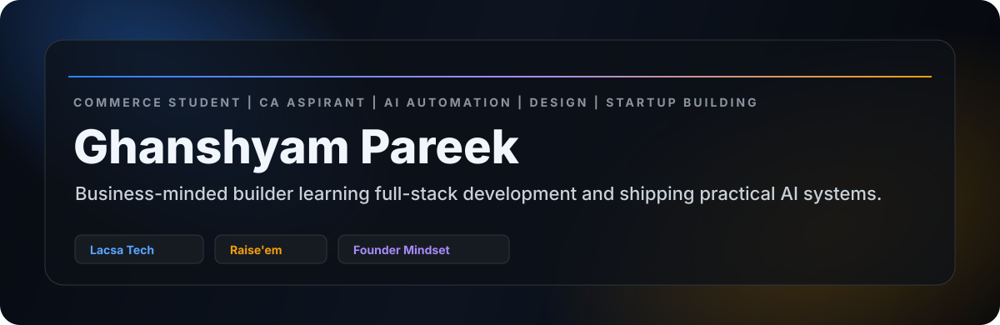
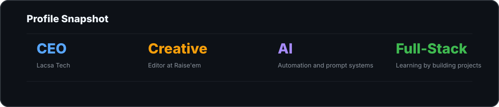

<picture>
  <source media="(max-width: 768px)" srcset="./assets/hero-profile-mobile.svg">
  
</picture>

 

 

AI AUTOMATION | GRAPHIC DESIGN | STARTUP OPERATIONS | FULL-STACK LEARNING | BUSINESS STRATEGY

 

> I am building at the intersection of commerce, AI automation, design, and startup execution. My focus is simple: learn fast, build useful systems, and turn ideas into clean digital products.

<picture>
  <source media="(max-width: 768px)" srcset="./assets/impact-premium-mobile.svg">
  
</picture>

 

## Founder Track | Lacsa Tech

STARTUP BUILDING | AI AUTOMATION | DIGITAL SYSTEMS | BUSINESS EXECUTION

Lacsa Tech is my startup-building track where I explore practical technology, business workflows, automation ideas, and creator-focused digital systems.

- Building a business-first technology mindset with AI and automation.
- Exploring workflow systems for students, creators, and startups.
- Learning how to connect product thinking, design, marketing, and execution.
- Growing through real projects instead of only theory.

## Creative & Content Work

GRAPHIC DESIGN | SOCIAL MEDIA MARKETING | BRAND VISUALS | EDITING

I work with design tools and content systems to make brands, products, and ideas look clear, sharp, and trustworthy.

- Graphic design using **Photoshop, Canva, and Figma**.
- Social media creatives, content planning, and visual storytelling.
- Creative Editor at **Raise'em**.
- Brand-first thinking for startup pages, posts, thumbnails, and launch assets.

<b>Creative toolkit</b>

 

`Photoshop` | `Canva` | `Figma` | `Content Creation` | `Social Media Marketing` | `Brand Identity` | `Visual Systems`

## AI & Automation

PROMPT ENGINEERING | WORKFLOW DESIGN | AI-ASSISTED OPERATIONS

I am interested in using AI as a real execution layer: faster research, sharper planning, better content workflows, automation experiments, and business productivity systems.

- Prompt engineering for practical business and creator workflows.
- AI-assisted content, planning, and operational systems.
- Automation ideas for repetitive tasks and startup execution.
- Experiments that connect business problems with simple digital solutions.

<b>Automation direction</b>

 

`Prompt Systems` | `AI Workflows` | `Business Automation` | `Content Systems` | `Productivity Tools` | `No-Code/Low-Code Thinking`

## Full-Stack Learning

HTML | CSS | JAVASCRIPT | REACT | NODE.JS | GIT | GITHUB

I am learning full-stack development by building and improving real projects. My goal is to understand both the technical side and the business reason behind each product.

### Build areas

- **Frontend:** clean layouts, responsive pages, and practical user interfaces.
- **JavaScript:** logic, interactivity, and project-based learning.
- **React:** component-based UI development.
- **Node.js:** backend fundamentals and APIs.
- **Git & GitHub:** public proof of work, version control, and project presentation.

## Project Directions

PUBLIC REPOSITORIES I AM BUILDING TOWARD

| Direction | What it proves | Suggested repo |
|:--|:--|:--|
| AI automation experiments | Prompt systems, workflows, and practical AI use | `ai-automation-lab` |
| Startup website | Branding, frontend, and business presentation | `lacsa-tech-website` |
| Design portfolio | Visual thinking, content, and creative direction | `creator-design-portfolio` |
| Business tools | React/Node learning with useful workflows | `business-tools-dashboard` |
| Startup operations notes | Strategy, planning, and execution thinking | `startup-ops-playbook` |

## Activity & Direction

STABLE PROFILE SECTION | NO BROKEN EXTERNAL CARDS

| Current focus | Building proof |
|:--|:--|
| AI automation | Prompt systems, workflow ideas, and productivity experiments |
| Full-stack learning | HTML, CSS, JavaScript, React, Node.js, Git, and GitHub projects |
| Design portfolio | Canva, Photoshop, Figma, brand visuals, and content systems |
| Startup operations | Lacsa Tech experiments, business strategy, and execution notes |

## Technical Stack

**Development**  
`HTML` | `CSS` | `JavaScript` | `React` | `Node.js` | `Git` | `GitHub`

**AI & Automation**  
`Prompt Engineering` | `Workflow Design` | `AI-Assisted Productivity` | `Automation Thinking`

**Creative & Business**  
`Photoshop` | `Canva` | `Figma` | `Content Creation` | `Social Media Marketing` | `Startup Operations` | `Business Strategy`

### Commerce gives me the lens. Design gives me clarity. Code gives me leverage.

[LinkedIn](https://linkedin.com/in/ghanshyam-pareek) | [Email](mailto:avdhuu.work@gmail.com) | [GitHub](https://github.com/ghanshyam-pareek-dev)

 

