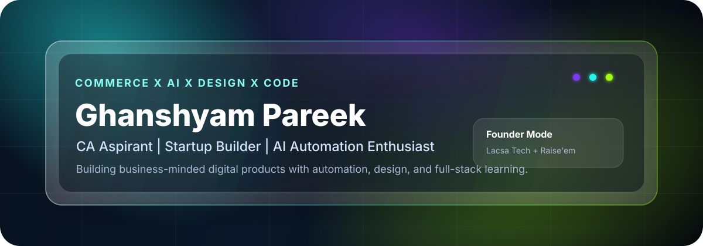
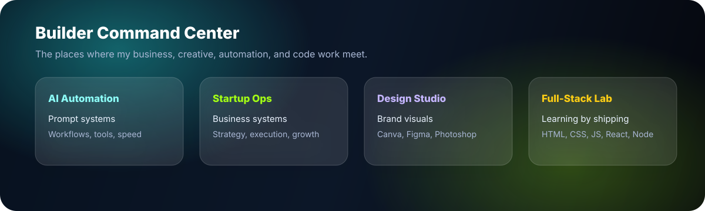

<div align="center">
  
</div>

<p align="center">
  <a href="https://linkedin.com/in/ghanshyam-pareek">
    
  </a>
  <a href="mailto:avdhuu.work@gmail.com">
    
  </a>
  <a href="https://github.com/ghanshyam-pareek-dev">
    
  </a>
</p>

<h3 align="center">Business-minded builder combining commerce, AI automation, design, and code.</h3>

<p align="center">
  I am a commerce student and CA aspirant building practical digital systems: automation workflows, startup assets, web projects, brand creatives, and tools that make execution faster.
</p>

---

<div align="center">
  
</div>

---

## Identity Stack

| Layer | What I Bring |
| --- | --- |
| Commerce + CA Mindset | Finance-first thinking, structure, discipline, and business understanding |
| AI + Automation | Prompt engineering, workflow ideas, productivity systems, and AI-assisted operations |
| Design + Content | Photoshop, Canva, Figma, social media creatives, brand visuals, and editing |
| Startup Building | CEO at Lacsa Tech, creative editor at Raise'em, strategy and operations |
| Web Development | Learning HTML, CSS, JavaScript, React, Node.js, Git, and GitHub through real projects |

---

## Current Roles

```txt
CEO              Lacsa Tech
Creative Editor  Raise'em
Learning Track   Full-stack development
Core Interest    AI automation + startup operations
```

---

## Tools I Use

<p>
  
  
  
  
  
  
  
  
  
  
</p>

---

## Featured Build Areas

| Project Direction | Why It Matters | Stack / Skill |
| --- | --- | --- |
| `ai-automation-lab` | Experiments with prompt systems, AI workflows, and automation ideas | AI, prompts, workflow design |
| `lacsa-tech-website` | Startup presence with clean brand execution | HTML, CSS, JavaScript |
| `creator-design-portfolio` | Social media creatives, thumbnails, brand posts, and design direction | Canva, Photoshop, Figma |
| `business-tools-dashboard` | Simple tools for tracking, planning, and startup operations | React, Node.js |
| `startup-ops-playbook` | Business strategy, content systems, and execution notes | Operations, marketing, systems |

---

## GitHub Snapshot

<p align="center">
  
  
</p>

---

## What I Am Building Toward

- Shipping useful projects instead of only collecting tutorials
- Turning business ideas into clean digital products
- Using AI to build smarter workflows for creators, students, and startups
- Growing Lacsa Tech into a practical technology and automation brand
- Combining commerce knowledge with modern development and design skills

---

<p align="center">
  <b>Open to learning, building, collaborating, and turning sharp ideas into useful systems.</b>
</p>

<p align="center">
  <a href="https://linkedin.com/in/ghanshyam-pareek">LinkedIn</a>
  |
  <a href="mailto:avdhuu.work@gmail.com">Email</a>
  |
  <a href="https://github.com/ghanshyam-pareek-dev">GitHub</a>
</p>
